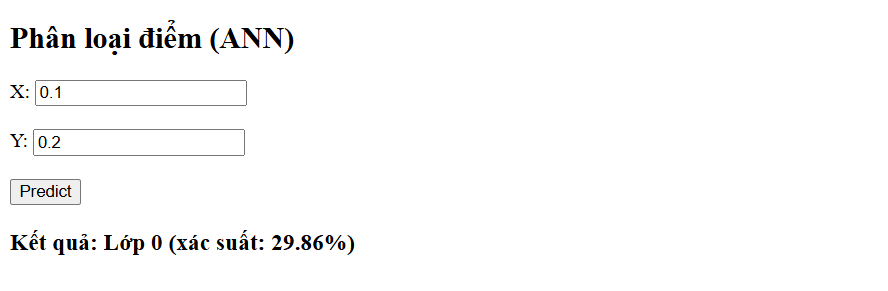
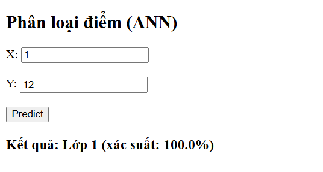

Mỗi điểm dữ liệu có dạng: (x, y)
Nhiệm vụ của mô hình là dự đoán điểm đó thuộc:
Lớp 0 (vùng trong)
Lớp 1 (vùng ngoài)

Dữ liệu được tạo ngẫu nhiên gồm 2 nhóm:
+ Class 0 (lớp 0):
Các điểm nằm trong hình tròn nhỏ
+ Class 1 (lớp 1):
Các điểm nằm trong vành đai (ring) bao quanh

gần tâm → thường là class 0

vòng ngoài → class 1